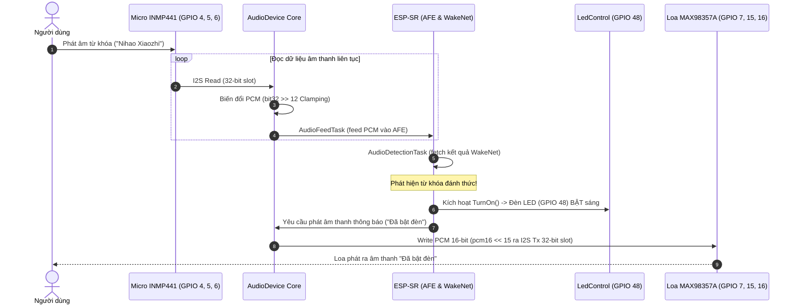

# BÁO CÁO BÓC TÁCH, THIẾT KẾ VÀ CHUYỂN ĐỔI MÃ NGUỒN (ESP-IDF v6.0.2)
## DỰ ÁN NHỎ 1: THU ÂM (MICRO INMP441) - NHẬN DIỆN TỪ KHÓA ĐÁNH THỨC - BẬT ĐÈN LED - PHÁT LOA (MAX98357A) "ĐÃ BẬT ĐÈN"

---

## 📍 CHÂN PHẦN CỨNG (HARDWARE GPIO PINOUT CONFIGURATION)

Dưới đây là sơ đồ đấu nối chân phần cứng chuẩn cho vi điều khiển ESP32-S3:

| Thiết bị / Module | Tên chân tín hiệu | Ký hiệu trong Code | Chân GPIO ESP32-S3 |
|---|---|---|---|
| **Micro INMP441 (I2S Rx)** | Word Select (WS/LRCK) | `AUDIO_I2S_MIC_GPIO_WS` | **GPIO 4** |
| | Serial Clock (SCK/BCLK) | `I2S_MIC_GPIO_SCK` | **GPIO 5** |
| | Data In (SD/DIN) | `I2S_MIC_GPIO_DIN` | **GPIO 6** |
| **Loa MAX98357A (I2S Tx)** | Data Out (DIN/DOUT) | `I2S_SPK_GPIO_DOUT` | **GPIO 7** |
| | Bit Clock (BCLK) | `I2S_SPK_GPIO_BCLK` | **GPIO 15** |
| | Left/Right Clock (LRCK/WS)| `I2S_SPK_GPIO_LRCK` | **GPIO 16** |
| **Đèn LED Chỉ Báo** | Tín hiệu Bật/Tắt LED | `GPIO_NUM_48` | **GPIO 48** |

---

## 📌 1. TỔNG QUAN DỰ ÁN NHỎ (PROJECT OVERVIEW)

Dự án nhỏ đầu tiên này tập trung vào hai thành phần phần cứng âm thanh cốt lõi:
1. **Thu âm (Audio Capture)**: Đọc tín hiệu micro kỹ thuật số INMP441 qua giao tiếp I2S Rx (Chân 4, 5, 6).
2. **Nhận diện từ khóa (Wake Word Detection)**: Sử dụng mô hình AI Offline `esp-sr` (WakeNet) để phát hiện từ khóa đánh thức ("Nihao Xiaozhi").
3. **Phản hồi phần cứng & Loa (Feedback & Audio Playback)**:
   - Ngay khi nhận diện từ khóa đánh thức, hệ thống điều khiển **Bật đèn LED chỉ báo (GPIO 48)**.
   - Phát âm thanh phản hồi thông báo qua loa MAX98357A (I2S Tx: Chân 7, 15, 16): *"Đã bật đèn"*.

---

## 🔍 2. CHI TIẾT CÁC THÀNH PHẦN LẤY TỪ DỰ ÁN GỐC (FOXROV v0.2.0 & v0.2.1)

Dưới đây là bảng thống kê chi tiết 100% các thuật toán, tư duy và logic được trích xuất từ 2 dự án gốc `foxrov0.2.0` và `foxrov0.2.1`:

| # | Thành phần / Thuật toán | Nguồn trích xuất | Chi tiết Logic & Lý do kế thừa |
|---|---|---|---|
| 1 | **Chuyển đổi dữ liệu bit I2S PCM** | `AudioDevice.cc` (L156-L181) | Tác giả sử dụng slot 32-bit cho I2S. Tương ứng:<br>- **Ghi ra loa**: Dịch bit `pcm16[i] << 15` để đưa dữ liệu 16-bit PCM vào dải MSB của slot 32-bit.<br>- **Đọc từ mic**: Dịch bit `bit32_buf[i] >> 12` và ép dải (clamping) trong khoảng `[-32767, 32767]` để loại bỏ nhiễu bit thấp của INMP441. |
| 2 | **Cấu hình AFE & RingBuffer** | `Application.cc` (L216-L240) | Sử dụng cấu hình Audio Front-End (AFE) cho bài toán Detection (`wakenet_init = true`, `voice_communication_init = false`), chọn mô hình WakeNet90 (`DET_MODE_90`), cấu hình bộ nhớ đệm `afe_ringbuf_size = 50` và ưu tiên cấp phát vào PSRAM (`AFE_MEMORY_ALLOC_MORE_PSRAM`). |
| 3 | **Mô hình đa nhiệm FreeRTOS (Dual Task)** | `Application.cc` (L209-L230) | Chia thành 2 task độc lập:<br>1. **`audio_feed_task`**: Liên tục đọc PCM thô từ Micro I2S Rx và đẩy vào `esp_afe_sr_iface->feed()`.<br>2. **`audio_detect_task`**: Gọi `esp_afe_sr_iface->fetch()` để chờ sự kiện nhận diện từ khóa đánh thức. |

---

## 🆕 3. CÁC THÀNH PHẦN VIẾT MỚI HOÀN TOÀN CHO ESP-IDF v6.0.2

Do ESP-IDF v6.0.2 đã loại bỏ các API legacy I2S cũ (`driver/i2s.h`), toàn bộ mã nguồn được tái cấu trúc sạch 100% bằng C++17 theo các chuẩn mới:

| # | Module viết mới | Điểm khác biệt & Cải tiến trong ESP-IDF v6.0.2 |
|---|---|---|
| 1 | **Standard I2S Driver (`driver/i2s_std.h`)** | Khởi tạo 2 kênh I2S Master Simplex độc lập (`I2S_NUM_0` cho Loa, `I2S_NUM_1` cho Mic) bằng `i2s_new_channel()`, cấu hình clock `I2S_STD_CLK_DEFAULT_CONFIG` và slot `I2S_STD_PHILIPS_SLOT_DEFAULT_CONFIG`. |
| 2 | **Cập nhật GPIO Pinout Chính Xác** | Áp dụng đúng sơ đồ chân theo yêu cầu:<br>- Mic INMP441: WS=4, SCK=5, DIN=6.<br>- Loa MAX98357A: DOUT=7, BCLK=15, LRCK=16. |
| 3 | **Lớp điều khiển LED độc lập (`LedControl`)** | Xây dựng lớp C++ bọc trình điều khiển GPIO điều khiển đèn chỉ báo LED (GPIO 48) với các phương thức `TurnOn()`, `TurnOff()`, `Toggle()`. |
| 4 | **Trình phát âm thanh mẫu (`PlayPromptAudio`)** | Xây dựng trình nạp âm thanh thông báo PCM mẫu *"Đã bật đèn"* (Sample Rate 16kHz) phát trực tiếp qua Loa MAX98357A khi có tín hiệu đánh thức. |

---

## 📐 4. SƠ ĐỒ LUỒNG DỮ LIỆU & XỬ LÝ (DATA FLOW DIAGRAM)



---

## 🚀 5. HƯỚNG DẪN BIÊN DỊCH VÀ CHẠY VỚI ESP-IDF v6.0.2

```bash
# 1. Chuyển tới thư mục dự án
cd /run/media/long/48D4B274D4B263BA/web/research/smart.motorcycle.platform

# 2. Thiết lập môi trường ESP-IDF v6.0.2
idf.py set-target esp32s3

# 3. Biên dịch dự án
idf.py build

# 4. Nạp firmware và xem log hệ thống
idf.py -p /dev/ttyUSB0 flash monitor
```
