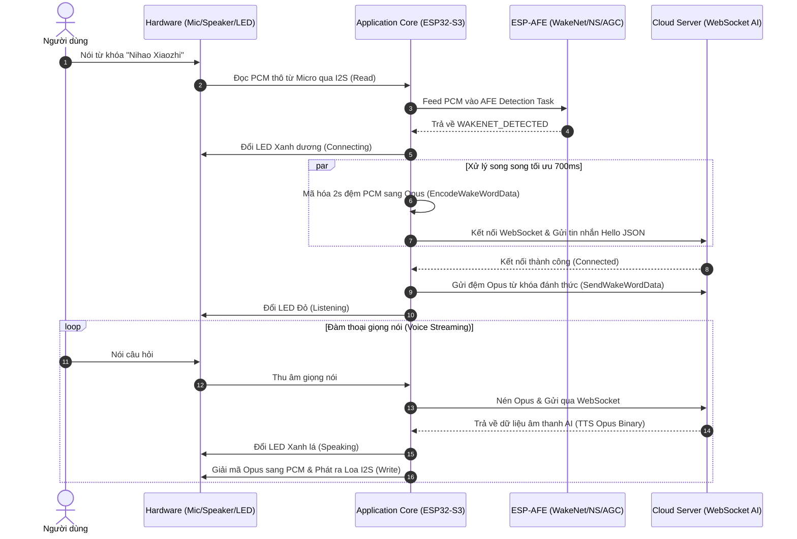

# BÓC TÁCH TOÀN BỘ DỰ ÁN ESP32-S3 AI VOICE ASSISTANT (FOXROV / XIAOZHI)

> **Tài liệu bóc tách chuyên sâu**: Phân tích toàn bộ kiến trúc, tư duy thiết kế, thư viện sử dụng và bóc tách 100% mã nguồn dự án gốc tại `/run/media/long/48D4B274D4B263BA/idfiot/AI/foxrov0.2.0` để phục vụ làm lại dự án Nền tảng xe máy thông minh (Smart Motorcycle Platform) tại địa chỉ `/run/media/long/48D4B274D4B263BA/web/research/smart.motorcycle.platform`.

---

## 📐 PHẦN 1: TỔNG QUAN & TƯ DUY KIẾN TRÚC (ARCHITECTURAL PHILOSOPHY)

Dự án gốc là hệ thống phần mềm nhúng (Firmware) cho vi điều khiển **ESP32-S3**, đóng vai trò là một **Trợ lý giọng nói AI (AI Voice Assistant)** truyền dữ liệu âm thanh hai chiều thời gian thực (real-time voice streaming) kết nối với hệ thống Server Cloud AI (sử dụng mô hình ASR SenseVoice, LLM Qwen-72B và TTS).

### 💡 1. Tư duy thiết kế chính của tác giả (Design Thinking):

1. **Kiến trúc Lai (Edge AI + Cloud AI Hybrid)**:
   * **Xử lý tại biên (Edge AI)**: Phát hiện từ khóa đánh thức ("你好小智" - Nihao Xiaozhi) hoàn toàn offline trên chip ESP32-S3 bằng mô hình mạng Nơ-ron lượng hóa (`WakeNet` trong thư viện `esp-sr`). Việc này giúp thiết bị **không tốn băng thông mạng** và **tiết kiệm năng lượng** khi đứng chờ.
   * **Xử lý trên mây (Cloud AI)**: Sau khi được đánh thức, thiết bị mới thiết lập kết nối mạng truyền giọng nói lên Cloud để AI hiểu ngôn ngữ tự nhiên (NLU) và tạo câu trả lời (LLM + TTS).

2. **Song song hóa tối ưu độ trễ (Parallel Latency Optimization)**:
   * Ngay khi phát hiện từ khóa đánh thức, thiết bị tạo 2 luồng công việc chạy song song:
     - **Luồng 1**: Mã hóa lại 2 giây đệm âm thanh PCM trước đó sang chuẩn Opus (`EncodeWakeWordData`).
     - **Luồng 2**: Mở kết nối WebSocket tới Server (`StartWebSocketClient`).
   * Việc thực hiện song song hai tác vụ này tiết kiệm được khoảng **700ms độ trễ**, giúp phản hồi của AI đạt cảm giác "tức thì".

3. **Tối ưu hóa quản lý bộ nhớ PSRAM trên ESP32-S3**:
   * Chuẩn nén âm thanh Opus và mô hình mạng nơ-ron AFE tốn rất nhiều bộ nhớ RAM (đặc biệt là dung lượng Stack cho mỗi Task FreeRTOS, khoảng 32KB).
   * Tác giả cấu hình sử dụng **Octal PSRAM 80MHz** (Bộ nhớ RAM ngoài 8MB/16MB), buộc cấp phát các đệm âm thanh lớn (`iovec`) vào PSRAM qua hàm `heap_caps_malloc(size, MALLOC_CAP_SPIRAM)`, giải phóng RAM nội (Internal SRAM) cho bộ đệm DMA của I2S và Wi-Fi stack.

4. **Đa nhiệm bất đồng bộ với FreeRTOS & Event Group**:
   * Hệ thống chia nhỏ xử lý thành 5 Task FreeRTOS chạy độc lập: `audio_feed`, `audio_detection`, `audio_communication`, `opus_encode`, `opus_decode`.
   * Việc đồng bộ giữa các Task được kiểm soát nghiêm ngặt qua `EventGroupHandle_t` với các cờ bit: `DETECTION_RUNNING`, `COMMUNICATION_RUNNING`, `DETECT_PACKETS_ENCODED`.

---

## 🛠️ PHẦN 2: CÁC THƯ VIỆN & CÔNG CỤ ĐƯỢC SỬ DỤNG (THIRD-PARTY DEPENDENCIES)

Tác giả khai báo các thư viện phụ thuộc trong file `main/idf_component.yml`:

| Thư viện / Component | Nguồn / Phiên bản | Chức năng chi tiết trong dự án |
| :--- | :--- | :--- |
| **`espressif/esp-sr`** | Espressif (`^1.9.0`) | Thư viện xử lý tín hiệu âm thanh & AI giọng nói của Espressif. Bao gồm **WakeNet9** (nhận diện từ khóa "你好小智"), **AFE** (Audio Front-End) giúp lọc nhiễu (SSP Noise Suppression), điều chỉnh âm lượng tự nhiên (AGC - Automatic Gain Control). |
| **`78/esp-opus-encoder`** | Component 3rd-party (`^1.0.0`) | Thư viện mã hóa và giải mã chuẩn nén âm thanh **Opus**. Opus cho chất lượng âm thanh cao ở bitrate thấp, cực kỳ phù hợp cho voice streaming qua mạng. |
| **`78/esp-websocket`** | Component 3rd-party (`^1.0.0`) | Trình kết nối WebSocket Client bảo mật (`wss://`), duy trì kênh truyền dữ liệu hai chiều dạng Binary (Audio Opus) và Text (JSON trạng thái). |
| **`78/esp-builtin-led`** | Component 3rd-party (`^1.0.0`) | Điều khiển đèn LED RGB tích hợp trên board để hiển thị trạng thái (Xanh dương, Đỏ, Xanh lá). |
| **`78/esp-wifi-connect`** | Component 3rd-party (`^1.0.0`) | Trình quản lý kết nối Wi-Fi Station và phát Wi-Fi AP (Captive Portal) để cấu hình mạng qua trình duyệt khi chưa có thông tin Wi-Fi. |
| **`78/esp-ota`** | Component 3rd-party (`^1.0.0`) | Hỗ trợ cập nhật Firmware qua mạng (Over-The-Air Update) tự động kiểm tra phiên bản mới từ Server. |
| **`cJSON`** | Tích hợp sẵn trong ESP-IDF | Thư viện phân tích và đóng gói chuỗi JSON (ví dụ: gửi JSON trạng thái, parse gói tin điều khiển từ Server). |
| **`driver/i2s_std.h`** | ESP-IDF v5.x SDK | Trình điều khiển giao tiếp phần cứng I2S (Inter-IC Sound) để làm việc với Micro kỹ thuật số (INMP441/ICS43434) và Mạch khuếch đại Loa (MAX98357A). |

---

## 🔍 PHẦN 3: BÓC TÁCH CHI TIẾT TỪNG TỆP MÃ NGUỒN (CODE BREAKDOWN)

---

### 🟢 1. Cấu hình hệ thống & Biên dịch (Root Level)

#### 🔹 `CMakeLists.txt` (Root)
```cmake
cmake_minimum_required(VERSION 3.16)
include($ENV{IDF_PATH}/tools/cmake/project.cmake)
set(PROJECT_VER "0.2.0")
project(xiaozhi)
```
* **Phân tích**: Khai báo phiên bản project `0.2.0`, đặt tên ứng dụng binary là `xiaozhi`. Nạp script biên dịch chuẩn của ESP-IDF SDK.

#### 🔹 `sdkconfig.defaults` & `sdkconfig.defaults.esp32s3`
* **Phân tích cấu hình chip**:
  * `CONFIG_BOOTLOADER_COMPILER_OPTIMIZATION_PERF=y`: Tối ưu hiệu năng Bootloader.
  * `CONFIG_BOOTLOADER_LOG_LEVEL_NONE=y`: Tắt log Bootloader để tăng tốc độ khởi động lên tối đa.
  * `CONFIG_BOOTLOADER_SKIP_VALIDATE_ALWAYS=y`: Bỏ qua bước kiểm tra lại checksum app binary khi khởi động để rút ngắn thời gian boot.
  * `CONFIG_BOOTLOADER_APP_ROLLBACK_ENABLE=y`: Bật tính năng Rollback tự động về phiên bản firmware cũ nếu bản OTA mới bị lỗi đơ/crash.
  * `CONFIG_ESP_DEFAULT_CPU_FREQ_MHZ_240=y`: Chạy CPU ESP32-S3 ở xung nhịp tối đa 240MHz.
  * `CONFIG_SPIRAM=y`, `CONFIG_SPIRAM_MODE_OCT=y`, `CONFIG_SPIRAM_SPEED_80M=y`: Kích hoạt Octal PSRAM chạy ở bus 80MHz.
  * `CONFIG_SPIRAM_MALLOC_ALWAYSINTERNAL=4096`: Các yêu cầu cấp phát bộ nhớ dưới 4KB sẽ ưu tiên lấy trong SRAM nội để đạt tốc độ cao nhất; bộ nhớ lớn hơn sẽ đẩy sang PSRAM.
  * `CONFIG_USE_WAKENET=y`, `CONFIG_SR_WN_WN9_NIHAOXIAOZHI_TTS=y`: Kích hoạt mô hình nhận diện giọng nói WakeNet 9 "Nihao Xiaozhi".
  * `CONFIG_ESPTOOLPY_FLASHSIZE_16MB=y` (trong `.esp32s3`): Định cấu hình bộ nhớ Flash vật lý là 16MB, mode QIO (Quad I/O), Instruction Cache 32KB, Data Cache 64KB.

#### 🔹 `partitions.csv` (Bảng phân vùng bộ nhớ Flash)
```csv
# Name,   Type, SubType, Offset,  Size, Flags
nvs,      data, nvs,     0x9000,    0x4000,
otadata,  data, ota,     0xd000,    0x2000,
phy_init, data, phy,     0xf000,    0x1000,
model,    data, spiffs,  0x100000,  1M,
factory,  app,  factory, 0x200000,  2M,
ota_0,    app,  ota_0,   0x400000,  2M,
ota_1,    app,  ota_1,   0x600000,  2M,
```
* **Chi tiết tư duy phân vùng**:
  * `nvs` (16KB tại `0x9000`): Lưu thông tin cấu hình Wi-Fi, Token.
  * `otadata` (8KB tại `0xd000`): Lưu trạng thái phân vùng Boot OTA hiện tại.
  * `model` (1MB tại `0x100000`): Định dạng SPIFFS, chứa trọng số (weights) mô hình AI WakeNet offline.
  * `factory` (2MB tại `0x200000`): Phân vùng chứa chương trình gốc ban đầu.
  * `ota_0` (2MB tại `0x400000`) & `ota_1` (2MB tại `0x600000`): Hai phân vùng luân phiên nhận bản nâng cấp phần mềm OTA.

#### 🔹 `pack.py` (Script đóng gói Firmware)
* **Tư duy tác giả**: Bình thường khi nạp ESP32 cần nạp riêng lẻ 4 file binary ở 4 địa chỉ offset khác nhau. Tác giả viết script Python này để nối tất cả các file binary (`bootloader.bin`, `partition-table.bin`, `srmodels.bin`, `xiaozhi.bin`) thành **duy nhất 1 file `xiaozhi.img` có dung lượng 4MB**, lấp đầy các khoảng trống bằng byte `0xFF`. Giúp việc nạp nhà máy (factory flashing) cực kỳ nhanh chóng. Tự động nén zip thành `xiaozhi.img.zip`.

#### 🔹 `publish.py` (Script tự động phát hành OTA)
* Script Python nạp môi trường `.env`, đọc phiên bản từ `CMakeLists.txt`, đẩy file `xiaozhi.bin` lên dịch vụ lưu trữ đám mây Alibaba Cloud OSS (`oss2`), tạo file `firmware.json` chứa URL và phiên bản, sau đó dùng lệnh `scp` đẩy file cấu hình lên Web Server OTA.

---

### 🟡 2. Mã nguồn ứng dụng chính (`main/`)

#### 🔹 `main/CMakeLists.txt`
```cmake
set(SOURCES "AudioDevice.cc"
            "SystemReset.cc"
            "Application.cc"
            "main.cc"
            )

idf_component_register(SRCS ${SOURCES}
                    INCLUDE_DIRS "."
                    )
```
* Đăng ký 4 file mã nguồn C++ chính vào hệ thống biên dịch ESP-IDF.

#### 🔹 `main/Kconfig.projbuild`
* Định nghĩa menu cấu hình `idf.py menuconfig`:
  * `WEBSOCKET_URL`: Chuỗi kết nối Server.
  * `WEBSOCKET_ACCESS_TOKEN`: Token xác thực thiết bị.
  * `AUDIO_INPUT_SAMPLE_RATE` (mặc định 16000Hz - 16kHz chuẩn cho xử lý giọng nói ASR).
  * `AUDIO_OUTPUT_SAMPLE_RATE` (mặc định 24000Hz - 24kHz chuẩn đầu ra âm thanh giọng nói TTS).
  * `AUDIO_DEVICE_I2S_GPIO_*`: Định nghĩa các chân phần cứng I2S (`BCLK=5`, `WS=4`, `DOUT=6`, `DIN=3`). Hỗ trợ cờ `AUDIO_DEVICE_I2S_SIMPLEX` cho phép tách chân BCLK/WS riêng cho Micro (`MIC_BCLK=11`, `MIC_WS=10`).

---

### 🔴 3. Điểm khởi chạy: `main/main.cc`

```cpp
extern "C" void app_main(void)
{
    // 1. Kiểm tra nút bấm reset hệ thống
    SystemReset system_reset;
    system_reset.CheckButtons();

    // 2. Khởi tạo Event Loop mặc định
    ESP_ERROR_CHECK(esp_event_loop_create_default());

    // 3. Khởi tạo NVS Flash
    esp_err_t ret = nvs_flash_init();
    if (ret == ESP_ERR_NVS_NO_FREE_PAGES || ret == ESP_ERR_NVS_NEW_VERSION_FOUND) {
        ESP_ERROR_CHECK(nvs_flash_erase());
        ret = nvs_flash_init();
    }
    ESP_ERROR_CHECK(ret);

    // 4. Mở namespace "wifi" trong NVS để kiểm tra cấu hình mạng
    nvs_handle_t nvs_handle;
    ret = nvs_open("wifi", NVS_READONLY, &nvs_handle);

    // 5. Nếu chưa có Wi-Fi -> Bật LED xanh dương nháy & Khởi động Captive Portal AP
    if (ret != ESP_OK) {
        auto& builtin_led = BuiltinLed::GetInstance();
        builtin_led.SetBlue();
        builtin_led.Blink(1000, 500);

        WifiConfigurationAp::GetInstance().Start("Xiaozhi");
        return;
    }
    nvs_close(nvs_handle);
    
    // 6. Nếu đã có Wi-Fi -> Khởi chạy Application
    Application::GetInstance().Start();

    // 7. Vòng lặp giám sát RAM còn trống mỗi 10 giây
    while (true) {
        vTaskDelay(10000 / portTICK_PERIOD_MS);
        int free_sram = heap_caps_get_minimum_free_size(MALLOC_CAP_INTERNAL);
        ESP_LOGI(TAG, "Free heap size: %u minimal internal: %u", SystemInfo::GetFreeHeapSize(), free_sram);
    }
}
```

* **Phân tích chi tiết**:
  * Hàm `app_main` là điểm bắt đầu. Tác giả áp dụng mô hình kiểm tra cờ sớm (Early Return). Nếu chưa có Wi-Fi, hệ thống đứng lại ở màn hình phát Wi-Fi AP tên `"Xiaozhi"` cho người dùng truy cập nhập SSID/Pass. Sau khi nạp Wi-Fi thành công, chip khởi động lại và đi tiếp bước 6 để chạy `Application`.

---

### 🔵 4. Xử lý phần cứng âm thanh: `main/AudioDevice.h` & `main/AudioDevice.cc`

#### `AudioDevice.h` - Cấu trúc dữ liệu âm thanh:
* `enum AudioPacketType`: Phân loại gói âm thanh gửi từ Server (`Start`, `Stop`, `Data`, `SentenceStart`, `SentenceEnd`).
* `struct AudioDataHeader` (`__attribute__((packed))`): Header gói âm thanh nhị phân nén Opus gửi từ WebSocket bao gồm `version`, `reserved`, `timestamp`, `payload_size`.
* `class AudioDevice`: Điều khiển kênh I2S TX (Phát) và RX (Thu).

#### `AudioDevice.cc` - Kỹ thuật xử lý tín hiệu PCM:

1. **Khởi tạo Kênh Duplex hoặc Simplex**:
   * Hàm `CreateSimplexChannels()` tạo 2 kênh I2S độc lập: Kênh TX dùng `I2S_NUM_0` phát loa, Kênh RX dùng `I2S_NUM_1` thu mic.
   * Định dạng Slot I2S được cấu hình mono 32-bit slot width (`I2S_DATA_BIT_WIDTH_32BIT`, `I2S_SLOT_MODE_MONO`). Cấu hình DMA Descriptor count = 6, frame num = 240.

2. **Chuyển đổi bit PCM (Write & Read)**:
   * **Ghi ra loa (`Write`)**:
     ```cpp
     int32_t buffer[samples];
     for (int i = 0; i < samples; i++) {
         buffer[i] = int32_t(data[i]) << 15;
     }
     i2s_channel_write(tx_handle_, buffer, samples * sizeof(int32_t), &bytes_written, portMAX_DELAY);
     ```
     * *Tại sao dịch trái 15 bit?* Loa I2S DAC (như MAX98357A) đọc dữ liệu 32-bit slot. Dữ liệu PCM giải mã từ Opus là 16-bit. Dịch trái 15 bit sẽ căn lề dữ liệu 16-bit vào phần cao của 32-bit slot I2S.
   * **Đọc từ Micro (`Read`)**:
     ```cpp
     i2s_channel_read(rx_handle_, bit32_buffer_, samples * sizeof(int32_t), &bytes_read, portMAX_DELAY);
     for (int i = 0; i < samples; i++) {
         int32_t value = bit32_buffer_[i] >> 12;
         dest[i] = (value > INT16_MAX) ? INT16_MAX : (value < -INT16_MAX) ? -INT16_MAX : (int16_t)value;
     }
     ```
     * *Tại sao dịch phải 12 bit & Clamping?* Micro MEMS kỹ thuật số đầu ra 24-bit căn lề trong 32-bit slot I2S. Dịch phải 12 bit thu được dữ liệu 16-bit PCM phù hợp cho bộ lọc AFE. Phép so sánh ép biên (Clamping) chống hiện tượng méo tiếng do tràn số (Overflow Clip).

3. **Tác vụ `AudioPlayTask`**:
   * Lấy gói âm thanh từ hàng đợi `audio_play_queue_`.
   * Khi nhận gói `kAudioPacketTypeStart`: Đổi trạng thái `playing_ = true`, phát sự kiện callback `on_state_changed_()`.
   * Khi nhận gói `kAudioPacketTypeSentenceEnd` và bị cờ `breaked_ == true` (người dùng ngắt lời AI): Xóa sạch hàng đợi phát hiện tại để dừng âm thanh ngay lập tức.

---

### 🟣 5. Bộ điều khiển trung tâm: `main/Application.h` & `main/Application.cc`

Tệp `Application.cc` là nơi chứa **toàn bộ trí tuệ và logic điều khiển** của hệ thống (559 dòng code).

#### 1. Khởi tạo `Application::Application()`:
* Tạo 2 Queue FreeRTOS: `audio_encode_queue_` (chứa đệm PCM chờ mã hóa) và `audio_decode_queue_` (chứa đệm Opus nhận từ mạng chờ giải mã).
* Đọc danh sách model AI trong SPIFFS bằng `esp_srmodel_init("model")`, tìm kiếm tên model WakeNet (`ESP_WN_PREFIX`) và NoiseNet (`ESP_NSNET_PREFIX`).
* Khởi tạo `opus_encoder_` ở tần số lấy mẫu 16kHz.
* Khởi tạo `opus_decoder_` ở tần số lấy mẫu 24kHz. Nếu tần số loa là 24kHz, cấu hình thêm `opus_resampler_`.

#### 2. Hàm `Start()`:
* Bật `audio_device_.Start(...)`.
* Tạo 2 Task tĩnh mã hóa/giải mã Opus với dung lượng Stack lớn (32KB):
  ```cpp
  const size_t opus_stack_size = 4096 * 8;
  audio_encode_task_stack_ = (StackType_t*)malloc(opus_stack_size);
  xTaskCreateStatic(..., "opus_encode", opus_stack_size, ...);
  ```
* Kết nối Wi-Fi Station (`WifiStation::GetInstance().Start()`).
* Kiểm tra nâng cấp OTA phần mềm (`firmware_upgrade_.CheckVersion()`).
* Khởi chạy `StartCommunication()` và `StartDetection()`.
* Đặt cờ `DETECTION_RUNNING` trong EventGroup.

#### 3. Quản lý luồng đệm âm thanh & Nhận diện từ khóa:

##### AFE Configuration (`StartDetection` & `StartCommunication`):
Cấu hình cấu trúc `afe_config_t`:
* `wakenet_init = true` khi ở chế độ nhận diện.
* `voice_communication_init = true`, `voice_communication_agc_init = true` (tăng âm lượng mic tự động AGC gain 10) khi đàm thoại.
* `memory_alloc_mode = AFE_MEMORY_ALLOC_MORE_PSRAM`: Đẩy bộ đệm AFE Ringbuffer vào PSRAM.

##### `AudioFeedTask()`:
```cpp
while (true) {
    audio_device_.Read(buffer, chunk_size);
    auto event_bits = xEventGroupGetBits(event_group_);
    if (event_bits & DETECTION_RUNNING) {
        esp_afe_sr_v1.feed(afe_detection_data_, buffer);
    } else if (event_bits & COMMUNICATION_RUNNING) {
        esp_afe_vc_v1.feed(afe_communication_data_, buffer);
    }
}
```
* Vòng lặp liên tục đọc từ micro và đẩy (`feed`) dữ liệu âm thanh vào engine AFE tương ứng với trạng thái hiện tại.

##### `StoreWakeWordData()` & `EncodeWakeWordData()`:
* Khi thiết bị ở chế độ chờ, `StoreWakeWordData` liên tục lưu 50 packet PCM (tương đương 2 giây âm thanh gần nhất) vào một danh sách `wake_word_pcm_` nằm trên bộ nhớ **PSRAM** (`MALLOC_CAP_SPIRAM`).
* Khi WakeNet báo từ khóa `WAKENET_DETECTED`:
  * Tác vụ dừng ngay `DETECTION_RUNNING`.
  * Đèn LED chuyển sang Xanh dương (`kChatStateConnecting`).
  * Gọi `EncodeWakeWordData()` chạy trên Task tĩnh riêng: Mã hóa 50 packet PCM vừa lưu sang định dạng Opus (`wake_word_opus_`), sau đó bật cờ `DETECT_PACKETS_ENCODED`.
  * Đồng thời gọi `StartWebSocketClient()` tạo kết nối `wss://`.

##### `StartWebSocketClient()`:
* Gửi Header HTTP: `Authorization: Bearer <Token>`, `Device-Id: <MacAddress>`.
* Khi WebSocket kết nối thành công (`OnConnected`): Gửi gói tin JSON chào hỏi (`"type":"hello", "wakeup_model":"nihaoxiaozhi", "audio_params":{"format":"opus", "sample_rate":16000, "channels":1}}`).
* Khi nhận dữ liệu từ WebSocket (`OnData`):
  * **Nếu là Binary**: Nhận đệm nén Opus từ TTS Server, tách `AudioDataHeader`, đóng gói vào `AudioPacket` và đẩy vào `audio_decode_queue_`.
  * **Nếu là Text (JSON)**: Parse bằng `cJSON`. Nếu `"type":"tts"`, kiểm tra trạng thái `"state"` (`start`, `stop`, `sentence_start`, `sentence_end`) để cập nhật trạng thái loa hoặc chỉnh sample rate.

##### `AudioEncodeTask()` & `AudioDecodeTask()`:
* **Encode Task**: Nhận PCM từ `audio_encode_queue_`, nén bằng Opus và phát qua WebSocket `ws_client_->Send(...)`.
* **Decode Task**: Nhận gói Opus từ `audio_decode_queue_`, gọi `opus_decode()`. Nếu tần số mẫu trả về khác tần số loa (ví dụ 16kHz trả về so với 24kHz đầu ra loa), gọi `opus_resampler_.Process(...)` để nội suy tần số trước khi đẩy vào `AudioDevice`.

---

### ⚪ 6. Nút Bấm Khôi Phục Hệ Thống: `main/SystemReset.h` & `main/SystemReset.cc`

```cpp
SystemReset::SystemReset() {
    gpio_config_t io_conf;
    io_conf.intr_type = GPIO_INTR_DISABLE;
    io_conf.mode = GPIO_MODE_INPUT;
    io_conf.pin_bit_mask = (1ULL << GPIO_NUM_1) | (1ULL << GPIO_NUM_2);
    io_conf.pull_down_en = GPIO_PULLDOWN_DISABLE;
    io_conf.pull_up_en = GPIO_PULLUP_ENABLE;
    gpio_config(&io_conf);
}
```
* **Chi tiết logic xử lý nút bấm**:
  * Chân `GPIO_NUM_1` và `GPIO_NUM_2` được cấu hình làm đầu vào (Input) với trở kéo lên nội bộ (`Pull-up`).
  * Trong hàm `CheckButtons()`:
    * Nếu nhấn **`GPIO_NUM_2`** (mức 0): Thực hiện xóa NVS (`ResetNvsFlash`) VÀ xóa phân vùng `otadata` (`esp_partition_erase_range`), chờ 3 giây rồi reboot về trạng thái xuất xưởng (`ResetToFactory`).
    * Nếu nhấn **`GPIO_NUM_1`** (mức 0): Chỉ xóa bộ nhớ NVS Flash (`ResetNvsFlash`) để xóa thông tin Wi-Fi, ép thiết bị quay lại chế độ cài đặt Wi-Fi AP.

---

## 🎯 PHẦN 4: BẢNG TỔNG KẾT BÓC TÁCH TOÀN BỘ DỰ ÁN



### 💎 Tóm tắt những điểm cốt lõi bạn cần nắm khi chuyển đổi sang dự án Smart Motorcycle Platform:
1. **Những cái họ DÙNG**: ESP-IDF SDK (v5.3+), ESP-SR (WakeNet9), Opus Codec, WebSocket Client, FreeRTOS, cJSON, Driver I2S Standard.
2. **Những cái họ VIẾT (Custom Code)**:
   * **`AudioDevice`**: Trình bọc I2S chuyển đổi 16-bit PCM ↔ 32-bit I2S slot bằng phép dịch bit `<< 15` và `>> 12`.
   * **`Application`**: Luồng điều khiển đa nhiệm FreeRTOS, quản lý bộ đệm xoay vòng 2 giây giọng nói trên PSRAM, thuật toán song song hóa kết nối WebSocket + nén âm thanh.
   * **`SystemReset`**: Logic quản lý GPIO nút bấm khôi phục cài đặt NVS / Factory.
   * **`pack.py`**: Tool nối các file bin ghép thành 1 file `.img` hoàn chỉnh 4MB.
3. **Tư duy Kiến trúc**: Tối đa hóa hiệu năng với Octal PSRAM 80MHz, tối ưu trễ 700ms bằng kỹ thuật bất đồng bộ song song, và xây dựng máy trạng thái `ChatState` trực quan phản hồi qua LED RGB.
